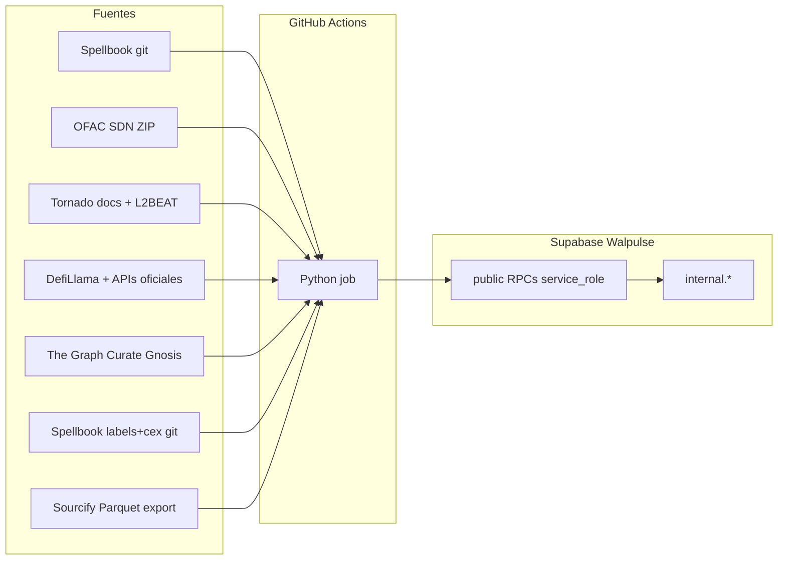

# Arquitectura — walpulse/workers

## Principio

Workers batch **off-line**: corren en GitHub Actions, leen fuentes externas (git, APIs), persisten en Supabase Walpulse. No son Edge Functions ni el sitio web.

## Patrones

| Patrón | Ejemplo | Cola |
|--------|---------|------|
| Reference sync | `cex_addresses`, `ofac_sdn`, `mixer_addresses`, `bridge_addresses`, `kleros_scout_addresses`, `spellbook_labels` | No — replace snapshot por SHA/hash |
| Incremental manifest | `sourcify_verified` | No — upsert por archivo Parquet (ETag); early exit si catch-up |
| Claim wallets | *(futuro)* | `FOR UPDATE SKIP LOCKED` o equivalente |

Walpulse v1 no copia el modelo de colas de GSA (`job_control`). Cada worker define su propio contrato de ingest.

## Seguridad

- `internal` no está en `[api].schemas` de PostgREST.
- RLS ON sin policies en tablas `internal`.
- `EXECUTE` de RPCs de ingest solo `service_role`.
- Secrets solo en GitHub Actions (y env local de desarrollo).

## Idempotencia

- **CEX:** comparar `source_commit` Spellbook vs `cex_addresses_sync`; skip si igual.
- **OFAC SDN:** comparar SHA-256 del ZIP vs `ofac_sdn_addresses_sync`; skip si igual.
- **Mixer:** comparar fingerprint compuesto vs `mixer_addresses_sync`; skip si igual. Cada fila incluye `privacy_mechanism` (`zk_pool`, `stealth`, `fhe_wrapper`, `tee`) por protocol slug — catalog-only hasta Origins.
- **Bridge:** comparar fingerprint compuesto vs `bridge_addresses_sync`; skip si igual.
- **Kleros Scout:** comparar fingerprint `(registry, itemID, resolutionTime)` vs `kleros_scout_addresses_sync`; skip si igual.
- **Spellbook labels:** comparar SHA-256 compuesto (`labels_commit:cex_commit`) vs `spellbook_labels_sync`; skip si igual.
- **Sourcify verified:** manifest `sourcify_export_files` por ETag; early exit `catch_up_complete` si no hay pendientes; presupuesto 5,5 h/corrida.
- **Replace:** staging → commit atómico; umbral de filas evita truncate accidental.

## Atribución de datos

- CEX: [duneanalytics/spellbook](https://github.com/duneanalytics/spellbook) (listas VALUES curadas). Walpulse no republica el SQL.
- OFAC: [Sanctions List Service](https://sanctionslist.ofac.treas.gov/Home/SdnList) (SDN Advanced XML). Walpulse persiste subset parseado.
- Mixer: [tornadocash/docs](https://github.com/tornadocash/docs) (contratos oficiales) + [L2BEAT Privacy discovery](https://github.com/l2beat/l2beat/tree/main/packages/config/src/projects). Walpulse persiste pools/routers/entrypoints filtrados.
- Bridge: [DefiLlama bridges-server](https://github.com/DefiLlama/bridges-server) + registros oficiales (Stargate, Wormhole, CCIP, Across, Axelar). Walpulse persiste gateways filtrados (no routers agregadores LI.FI/Socket).
- Kleros Scout: [legacy-curate-gnosis](https://thegraph.com/explorer/subgraphs/9hHo5MpjpC1JqfD3BsgFnojGurXRHTrHWcUcZPPCo6m8) (The Graph, primario en código) + [Envio HyperIndex](https://indexer.hyperindex.xyz/1a2f51c/v1/graphql) (fallback operativo desde 2026-08-28 — subgraph Graph **NOT INDEXED**, sin allocations). Walpulse persiste entradas TCR curadas (Address Tags, Tokens, Contract-Domain).
- Spellbook labels: [duneanalytics/spellbook](https://github.com/duneanalytics/spellbook) (`labels/addresses` VALUES + `cex/addresses` mapeado). Walpulse persiste subset estático; no replica `labels.addresses` query-based.
- Sourcify: [export.sourcify.dev](https://export.sourcify.dev) Parquet v2 (Verifier Alliance schema). Walpulse persiste lookup slim `(chain_id, address)` + flags de match; sin source code.

---

Ver [PROCESSES.md](./PROCESSES.md) · [SUPABASE.md](./SUPABASE.md)
