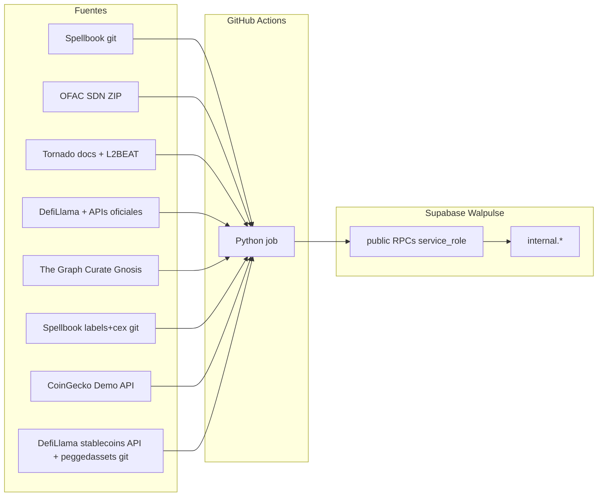

# Arquitectura — walpulse/workers

## Principio

Workers batch **off-line**: corren en GitHub Actions, leen fuentes externas (git, APIs), persisten en Supabase Walpulse. No son Edge Functions ni el sitio web.

## Patrones

| Patrón | Ejemplo | Cola |
|--------|---------|------|
| Reference sync | `cex_addresses`, `ofac_sdn`, `mixer_addresses`, `bridge_addresses`, `kleros_scout_addresses`, `spellbook_labels`, `token_taxonomy`, `airdrop_contracts`, `protocol_addresses` | No — replace snapshot por SHA/hash |
| Deliverable PDF | `analisis_pdf` | No — cola `pdf_cid IS NULL` sobre `analisis_requests` |
| Claim wallets | *(futuro)* | `FOR UPDATE SKIP LOCKED` o equivalente |

Walpulse v1 no copia el modelo de colas de GSA (`job_control`). Cada worker define su propio contrato de ingest.

## Seguridad

- `internal` no está en `[api].schemas` de PostgREST.
- RLS ON sin policies en tablas `internal`.
- `EXECUTE` de RPCs de ingest solo `service_role`.
- Secrets solo en GitHub Actions (y env local de desarrollo).

## Idempotencia

- **CEX:** comparar `source_commit` Spellbook vs `cex_addresses_sync`; skip si igual.
- **OFAC SDN:** comparar SHA-256 del ZIP vs `ofac_sdn_addresses_sync`; skip si igual.
- **Mixer:** fingerprint compuesto vs `mixer_addresses_sync`; skip si igual. Filas con `privacy_mechanism` + `catalog_tier` (`canonical`/`fork`). Fuentes: Tornado + L2BEAT + Railgun deployments + Cyclone docs.
- **Bridge:** comparar fingerprint compuesto vs `bridge_addresses_sync`; skip si igual.
- **Kleros Scout:** comparar fingerprint `(registry, itemID, resolutionTime)` vs `kleros_scout_addresses_sync`; skip si igual.
- **Spellbook labels:** comparar SHA-256 compuesto (`labels_commit:cex_commit`) vs `spellbook_labels_sync`; skip si igual.
- **Token taxonomy:** comparar fingerprint CoinGecko + DefiLlama vs `token_taxonomy_sync`; skip si igual (~42 créditos CG/sync + clone git DL).
- **Airdrop contracts:** fingerprint YAML + clones vs sync; factories usan cursors `airdrop_factory_scan` (incremental; bootstrap lookback sin cursor; `--force` full). `eth_getLogs` chunk adaptativo (Alchemy Free ≤10 bloques).
- **Protocol addresses:** fingerprint compuesto por capas (`official` seed + opcional Spellbook/DefiLlama) vs `protocol_addresses_sync`; `commit` preserva `origin=discovered`.
- **Analisis PDF:** filas Estándar/Experta `succeeded*` con `analisis_cid` y `pdf_cid IS NULL`; `set_analisis_request_pdf_cid` solo si sigue null.
- **Replace:** staging → commit atómico; umbral de filas evita truncate accidental.

## Atribución de datos

- CEX: [duneanalytics/spellbook](https://github.com/duneanalytics/spellbook) (listas VALUES curadas). Walpulse no republica el SQL.
- OFAC: [Sanctions List Service](https://sanctionslist.ofac.treas.gov/Home/SdnList) (SDN Advanced XML). Walpulse persiste subset parseado.
- Mixer: [tornadocash/docs](https://github.com/tornadocash/docs) (contratos oficiales) + [L2BEAT Privacy discovery](https://github.com/l2beat/l2beat/tree/main/packages/config/src/projects). Walpulse persiste pools/routers/entrypoints filtrados.
- Bridge: [DefiLlama bridges-server](https://github.com/DefiLlama/bridges-server) + registros oficiales (Stargate, Wormhole, CCIP, Across, Axelar). Walpulse persiste gateways filtrados (no routers agregadores LI.FI/Socket).
- Kleros Scout: Goldsky privado `walpulse-scout-curate/1.0.0` (gtcr-subgraph propio, Gnosis). Endpoint privado + `GOLDSKY_API_KEY`. Envio público no es fuente de prod (cobertura incompleta). Walpulse persiste Address Tags, Tokens canónico, Contract-Domain/CDN.
- Spellbook labels: [duneanalytics/spellbook](https://github.com/duneanalytics/spellbook) (`labels/addresses` VALUES + `cex/addresses` mapeado). Walpulse persiste subset estático; no replica `labels.addresses` query-based.
- Token taxonomy: [CoinGecko Demo API](https://www.coingecko.com/en/api) (12 categorías CG + top-100 market cap) + [DefiLlama stablecoins](https://stablecoins.llama.fi/) / [peggedassets-server](https://github.com/DefiLlama/peggedassets-server) (v1.1 híbrido). Walpulse persiste tags `stable`, `meme`, `airdrop`, `bluechip` por `(chain_id, address)` EVM — merge union CG ∪ DL.
- Airdrop contracts: curated YAML + [Sablier factories](https://docs.sablier.com/guides/airdrops/deployments) (`CreateMerkle*` vía `ALCHEMY_KEY`) + Spellbook metadata. Scan factory **incremental**; Free Alchemy requiere chains habilitadas (OP Mainnet / Scroll / Linea) y chunks ≤10 bloques/`getLogs`.
- Protocol addresses: address books oficiales (seed curado) + Spellbook VALUES (P1) + DefiLlama adapters allowlist (P2). Factories/routers/registries — no pools LP. LI.FI/Socket como `kind=aggregator` (no bridge).

---

Ver [PROCESSES.md](./PROCESSES.md) · [SUPABASE.md](./SUPABASE.md)
