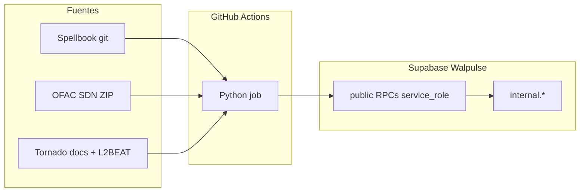

# Arquitectura — walpulse/workers

## Principio

Workers batch **off-line**: corren en GitHub Actions, leen fuentes externas (git, APIs), persisten en Supabase Walpulse. No son Edge Functions ni el sitio web.

## Patrones

| Patrón | Ejemplo | Cola |
|--------|---------|------|
| Reference sync | `cex_addresses`, `ofac_sdn`, `mixer_addresses` | No — replace snapshot por SHA/hash |
| Claim wallets | *(futuro)* | `FOR UPDATE SKIP LOCKED` o equivalente |

Walpulse v1 no copia el modelo de colas de GSA (`job_control`). Cada worker define su propio contrato de ingest.

## Seguridad

- `internal` no está en `[api].schemas` de PostgREST.
- RLS ON sin policies en tablas `internal`.
- `EXECUTE` de RPCs de ingest solo `service_role`.
- Secrets solo en GitHub Actions (y env local de desarrollo).

## Idempotencia

- **CEX:** comparar `source_commit` Spellbook vs `cex_addresses_sync`; skip si igual.
- **OFAC SDN:** comparar SHA-256 del ZIP vs `ofac_sdn_addresses_sync`; skip si igual.
- **Mixer:** comparar fingerprint compuesto vs `mixer_addresses_sync`; skip si igual.
- **Replace:** staging → commit atómico; umbral de filas evita truncate accidental.

## Atribución de datos

- CEX: [duneanalytics/spellbook](https://github.com/duneanalytics/spellbook) (listas VALUES curadas). Walpulse no republica el SQL.
- OFAC: [Sanctions List Service](https://sanctionslist.ofac.treas.gov/Home/SdnList) (SDN Advanced XML). Walpulse persiste subset parseado.
- Mixer: [tornadocash/docs](https://github.com/tornadocash/docs) (contratos oficiales) + [L2BEAT Privacy discovery](https://github.com/l2beat/l2beat/tree/main/packages/config/src/projects). Walpulse persiste pools/routers/entrypoints filtrados.

---

Ver [PROCESSES.md](./PROCESSES.md) · [SUPABASE.md](./SUPABASE.md)
